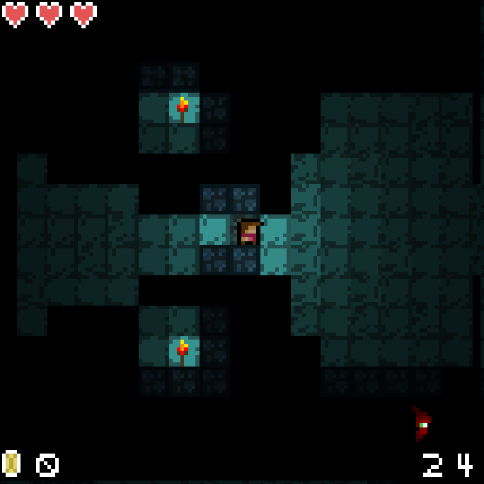

# Dendgeon V. 0.3.4

Get it? It's a play on words of dungeon and engine... 😐

## See it in action [here!](https://nottimtam.github.io/dendgeon/engine/)

## About

<em>An in-engine screenshot from version 0.3.3.</em>

Did somebody say "lightweight, retro-themed, easy-to-understand, easier-to-learn, dungeon crawler engine"?

N-no?

Anyway, this is all of those things. First and foremost, it is a dungeon crawler game I am building in vanilla JS. That's right! No node, and no rendering libraries! Just good old fashioned JS and HTML Canvas. The entire engine is built from the ground up to maximize efficieny while running at a constant 60fps (on any mid-range computer hardware)

Being HTML you can easily export this to an NW.js desktop application, mobile app, or anything else that can run an HTML page.

There isn't official documentation yet, but everything is thoroughly commented and easy to read. The engine itself is relatively simple, and the game loop follows the common-

1. User input.
2. Game logic.
3. Game rendering.

-game loop methodology. Every object in the game utilizes these three functions at their core, meaning implementing brand new functionality into the engine is easy.

### What Features Are Included Out of the Box?

-   **Player** with attacking, inventory, and health.
-   **Modifiable UI** with a built in minimap.

-   Efficient, complex **spritesheet-based image rendering system**.

    -   One for **rendering static objects** from a spritesheet. (faster than having thousands of images that have to be loaded in individually)
        

    -   The other, for **rendering an animation**, or animations from a spritestrip.
        

-   Tile based **rooms with events and triggers**.
-   A robust, but simple, **object-focused collision system**. (meaning each object can handle its own collisions differently, and handle what objects it will collide with)
-   (Potentially) **infinite room generation using simplex noise** and custom template-built rooms. (capped at a certain amount of rooms (default 25, but tested up to 500) but could theoretically go on forever, given enough memory...)
-   Multi-source **RAYTRACED lighting** system. (employs raytracing methods, does not require an RTX GPU)
-   Enemies with AI.

#### Noteable Small Features

-   Raycasting.
-   A fully posable camera with smart rendering. (only what is on-screen, is rendered)
-   Fully customizable item system.
-   Fully customizable entity system.

### Roadmap of Potential Features

By building the crawler out as a full game, I am able to implement features that are useful for people building their own game in the engine. Here are just a few of the big things I plan on adding:

-   More enemies.
-   Different size/shape rooms.
-   True 2.5d rendering.
-   Levels with increasing difficulty.
-   A boss room.
-   Better collision system that is global-focused rather than object-focused and more efficient.
-   Player dying/respawning.
-   ~~Raycast lighting.~~ (ADDED V.0.3.3)
-   Sound effects.
-   Move all spritesheets to new spritesheet loading system.
-   ~~Add global animation functions.~~ (ADDED V.0.3.4)
-   Doom-like 3D rendering with raycasting.
-   Chest room.
-   More kinds of loot.
-   Enemy drops.
